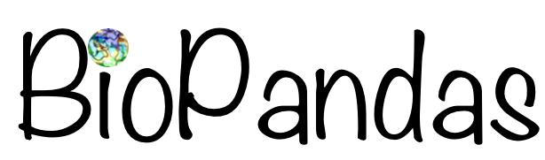

.. image:: https://travis-ci.org/rasbt/biopandas.svg?branch=master
    :target: https://travis-ci.org/rasbt/biopandas
    :alt: Continuous Integration
.. image:: https://coveralls.io/repos/rasbt/biopandas/badge.svg?branch=master&service=github
    :target: https://coveralls.io/github/rasbt/biopandas?branch=master
    :alt: Code Coverage
.. image:: https://landscape.io/github/rasbt/biopandas/master/landscape.svg?style=flat
    :target: https://landscape.io/github/rasbt/biopandas/master
    :alt: Code Health
.. image:: https://img.shields.io/pypi/v/biopandas.svg
    :target: https://pypi.python.org/pypi/biopandas/
    :alt: PyPI Version
.. image:: https://img.shields.io/badge/license-BSD-blue.svg
    :target: https://github.com/rasbt/biopandas/blob/master/LICENSE
    :alt: License
.. image:: https://img.shields.io/badge/python-2.7-blue.svg
    :alt: Python 2.7
.. image:: https://img.shields.io/badge/python-3.5-blue.svg
   :alt: Python 3.5

Working with molecular structures in pandas DataFrames
