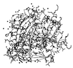

# Release Notes 

The CHANGELOG for the current development version is available at
[https://github.com/rasbt/biopandas/blob/master/docs/sources/CHANGELOG.md](https://github.com/rasbt/biopandas/blob/master/docs/sources/CHANGELOG.md).

### 0.3.0 (TBA)

##### Downloads

- [Source code (zip)](https://github.com/rasbt/biopandas/archive/v0.3.0.zip)
- [Source code (tar.gz)](https://github.com/rasbt/biopandas/archive/v0.3.0.tar.gz)

##### New Features

- -

##### Changes

- `ValueError` raising and improved file format error messages for `read_pdb` and `read_mol2` functionality. (via PR [73](https://github.com/rasbt/biopandas/pull/73/files) by [dominiquesydow](https://github.com/dominiquesydow))

##### Bug Fixes

- -

### 0.2.7 (08-04-2020)

##### Downloads

- [Source code (zip)](https://github.com/rasbt/biopandas/archive/v0.2.7.zip)
- [Source code (tar.gz)](https://github.com/rasbt/biopandas/archive/v0.2.7.tar.gz)

##### New Features

- -

##### Changes

- -

##### Bug Fixes

- Fix Manifest file to include license file in the PyPI tar.gz file so that BioPandas can be packaged by conda-forge.

### 0.2.6 (08-03-2020)

##### Downloads

- [Source code (zip)](https://github.com/rasbt/biopandas/archive/v0.2.6.zip)
- [Source code (tar.gz)](https://github.com/rasbt/biopandas/archive/v0.2.6.tar.gz)

##### New Features

- -

##### Changes

- Uses more modern `https` queries for the RCSB server via the `fetch_pdb` function.
- Updates the documentation (incl. a code of conduct)

##### Bug Fixes

- -

### 0.2.5 (07-09-2019)

##### Downloads

- [Source code (zip)](https://github.com/rasbt/biopandas/archive/v0.2.5.zip)
- [Source code (tar.gz)](https://github.com/rasbt/biopandas/archive/v0.2.5.tar.gz)

##### New Features

- -

##### Changes

- -

##### Bug Fixes

- The `PandasPdb.amino3to1` method now also considers insertion codes when converting the amino acid codes; before, inserted amino acides were skipped. 

### 0.2.4 (02-05-2019)

##### Downloads

- [Source code (zip)](https://github.com/rasbt/biopandas/archive/v0.2.4.zip)
- [Source code (tar.gz)](https://github.com/rasbt/biopandas/archive/v0.2.4.tar.gz)

##### New Features

- -

##### Changes

- Minor adjustments to support to address deprecation warnings in pandas >= 23.0

##### Bug Fixes

- -

### 0.2.3 (03-29-2018)

##### Downloads

- [Source code (zip)](https://github.com/rasbt/biopandas/archive/v0.2.3.zip)
- [Source code (tar.gz)](https://github.com/rasbt/biopandas/archive/v0.2.3.tar.gz)

##### New Features

- -

##### Changes

- `PandasMol2.distance_df` was added as a static method that allows distance computations based for external data frames with its behavior otherwise similar to `PandasMol2.distance`.
- `PandasPdb.distance_df` was added as a static method that allows distance computations based for external data frames with its behavior otherwise similar to `PandasPdb.distance`.
- `PandasPdb.distance` now supports multiple record sections to be considered (e.g., `records=('ATOM', 'HETATM')` to include both protein and ligand in a query. Now also defaults to `records=('ATOM', 'HETATM')` for concistency with the impute method.
- `PandasPdb.get(...)` now supports external data frames and lets the user specify the record section to be considered (e.g., `records=('ATOM', 'HETATM')` to include both protein and ligand in a query. Now also defaults to `records=('ATOM', 'HETATM')` for concistency with the impute method.
- The `section` parameter of `PandasPdb.impute_element(...)` was renamed to `records` for API consistency.

##### Bug Fixes

-

### 0.2.2 (06-07-2017)

##### Downloads

- [Source code (zip)](https://github.com/rasbt/biopandas/archive/v0.2.2.zip)
- [Source code (tar.gz)](https://github.com/rasbt/biopandas/archive/v0.2.2.tar.gz)

##### New Features

- -

##### Changes

-  Raises a meaningful error message if attempting to overwrite the `df` attributes of `PandasMol2` and `PandasPdb` directly.
-  Added `PandasPdb.pdb_path` and `PandasMol2.mol2_path` attributes that store the location of the data file last read.

##### Bug Fixes

- The `rmsd` methods of `PandasMol2` and `PandasPdb` don't return a NaN anymore if the array indices of to structures are different.

### 0.2.1  (2017-05-11)

##### Downloads

- [Source code (zip)](https://github.com/rasbt/biopandas/archive/v0.2.1.zip)
- [Source code (tar.gz)](https://github.com/rasbt/biopandas/archive/v0.2.1.tar.gz)

##### New Features

- -

##### Changes

- The `amino3to1` method of `biopandas.pdb.PandasPDB` objects now returns a pandas `DataFrame` instead of a pandas `Series` object. The returned data frame has two columns, `'chain_id'` and `'residue_name'`, where the former contains the chain ID of the amino acid and the latter contains the 1-letter amino acid code, respectively.
-  Significant speed improvements of the `distance` method of both `PandasPdb` and `PandasMol2` (now about 300 percent faster than previously).

##### Bug Fixes

- The `amino3to1` method of `biopandas.pdb.PandasPDB` objects now handles multi-chain proteins correctly.
- The `amino3to1` method of `biopandas.pdb.PandasPDB` objects now also works as expected if the `'ATOM'` entry DataFrame contains disordered DataFrame indices or duplicate DataFrame index values.

### 0.2.0 (2017-04-02)

##### Downloads

- [Source code (zip)](https://github.com/rasbt/biopandas/archive/v0.2.0.zip)
- [Source code (tar.gz)](https://github.com/rasbt/biopandas/archive/v0.2.0.tar.gz)

##### New Features

- Added an `amino3to1` method to `PandasPdb` data frames to convert 3-amino acid letter codes to 1-letter codes.
- Added a `distance` method to `PandasPdb` data frames to compute the Euclidean distance between atoms and a reference point.
- Added the `PandasMol2` class for working with Tripos MOL2 files in pandas DataFrames.

##### Changes

- `PandasPDB` was renamed to `PandasPdb`.
- Raises a warning if `PandasPdb` is written to PDB and ATOM and HETAM section contains unexpected columns; these columns will now be skipped.

##### Bug Fixes

- -

### 0.1.5 (2016-11-19)

##### Downloads

- [Source code (zip)](https://github.com/rasbt/biopandas/releases/tag/v0.1.5)
- [Source code (tar.gz)](https://github.com/rasbt/biopandas/releases/tag/v0.1.5.tar.gz)

##### New Features

- Added an `impute_element` method to `PandasPDB` objects to infer the Element Symbol from the Atom Name column.
- Added two new selection types for `PandasPDB` ATOM and HETATM coordinate sections: `'heavy'` and `'carbon'`.

##### Changes

- Include test data in the PyPI package; add install_requires for pandas.
- The `'hydrogen'` atom selection in `PandasPDB` methods is now based on the element type instead of the atom name.
- By default, the RMSD is now computed on all atoms unless a specific selection is defined.

##### Bug Fixes

- -

### 0.1.4 (2015-11-24)

##### Downloads

- [Source code (zip)](https://github.com/rasbt/biopandas/releases/tag/v0.1.4)
- [Source code (tar.gz)](https://github.com/rasbt/biopandas/releases/tag/v0.1.4.tar.gz)

##### New Features

-

##### Changes

- Needed to bump the version number due to a bug in the PyPI setup.py script.
- Support for the old pandas sorting syntax (`DataFrame.sort` vs `DataFrame.sort_values`) incl. DeprecationWarning.

##### Bug Fixes

-

### 0.1.3 (2015-11-23)

##### New Features

-

##### Changes

-

##### Bug Fixes

- Exception handling in tests if PDB goes down (which just happened).
- Added a separate ANISOU engine to handle those records correctly.

### 0.1.2 (2015-11-23)

- First Release.
