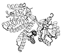
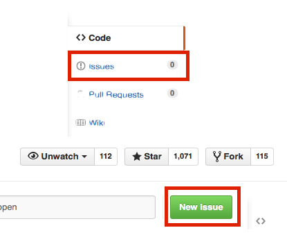
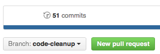

# How to Contribute 

I would be very happy about any kind of contributions that help to improve and extend the functionality of biopandas.

### Code of Conduct

If this is your first contribution, please review the [Code of Conduct](CODE_OF_CONDUCT.md).


### Quick Contributor Checklist

This is a quick checklist about the different steps of a typical contribution to biopandas and
other open source projects. Consider copying this list to a local text file (or the issue tracker)
and checking off items as you go.

1. [ ]  Open a new "issue" on GitHub to discuss the new feature / bug fix  
2. [ ]  Fork the biopandas repository from GitHub (if not already done earlier)
3. [ ]  Create and checkout a new topic branch   
4. [ ]  Implement new feature or apply the bug-fix  
5. [ ]  Add appropriate unit test functions  
6. [ ]  Run `nosetests -sv` and make sure that all unit tests pass  
7. [ ]  Check/improve the test coverage by running `nosetests --with-coverage`
8. [ ]  Add a note about the change to the `./docs/sources/CHANGELOG.md` file  
9. [ ]  Modify documentation in the appropriate location under `biopandas/docs/sources/`  
10. [ ]  Push the topic branch to the server and create a pull request
11. [ ]  Check the Travis-CI build passed at [https://travis-ci.org/rasbt/biopandas](https://travis-ci.org/rasbt/biopandas)
12. [ ]  Check/improve the unit test coverage at [https://coveralls.io/github/rasbt/biopandas](https://coveralls.io/github/rasbt/biopandas)
13. [ ]  Check/improve the code health at [https://landscape.io/github/rasbt/biopandas](https://landscape.io/github/rasbt/biopandas)
14. [ ]  Squash many small commits to a larger commit

<br>


## Getting Started - Creating a New Issue and Forking the Repository

- If you don't have a [GitHub](https://github.com) account yet, please create one to contribute to this project.
- Please submit a ticket for your issue to discuss the fix or new feature before too much time and effort is spent for the implementation.



- Fork the `biopandas` repository from the GitHub web interface.


- Clone the `biopandas` repository to your local machine
	- `git clone https://github.com/<your_username>/biopandas.git`

## Syncing an Existing Fork

If you already forked biopandas earlier, you can bring you "Fork" up to date
with the main branch as follows:

#### 1. Configuring a remote that points to the upstream repository on GitHub

List the current configured remote repository for your fork by executing

```bash
$ git remote -v
```

If you see something like

```bash
origin	https://github.com/<your username>/biopandas.git (fetch)
origin	https://github.com/<your username>/biopandas.git (push)
```
you need to specify a new remote *upstream* repository via

```bash
$ git remote add upstream https://github.com/rasbt/biopandas.git
```

Now, verify the new upstream repository you've specified for your fork by executing

```bash
$ git remote -v
```

You should see following output if everything is configured correctly:

```bash
origin	https://github.com/<your username>/biopandas.git (fetch)
origin	https://github.com/<your username>/biopandas.git (push)
upstream	https://github.com/rasbt/biopandas.git (fetch)
upstream	https://github.com/rasbt/biopandas.git (push)
```

#### 2. Syncing your Fork

First, fetch the updates of the original project's `main` branch by executing:

```bash
$ git fetch upstream
```

You should see the following output

```bash
remote: Counting objects: xx, done.
remote: Compressing objects: 100% (xx/xx), done.
remote: Total xx (delta xx), reused xx (delta x)
Unpacking objects: 100% (xx/xx), done.
From https://github.com/rasbt/biopandas
 * [new branch]      main         -> upstream/main
```

This means that the commits to the `rasbt/biopandas` `main` branch are now
stored in the local branch `upstream/main`.

If you are not already on your local project's main branch, execute

```bash
$ git checkout main
```

Finally, merge the changes in upstream/main to your local main branch by
executing

```bash
$ git merge upstream/main
```

which will give you an output that looks similar to

```bash
Updating xxx...xxx
Fast-forward
SOME FILE1                    |    12 +++++++
SOME FILE2                    |    10 +++++++
2 files changed, 22 insertions(+),
```


## Making Changes in a New Topic Branch

#### 1. Creating a new feature branch

Please avoid working directly on the main branch but create a new feature branch:

```bash
$ git branch <new_feature>
```

Switch to the new feature branch by executing

```bash
$ git checkout <new_feature>
```

#### 2. Developing the new feature / bug fix

#### 3. Testing your code

Adding/modifying the unit tests and check if they pass:

```bash
$ nosetests -sv
```

```bash
$ nosetests --with-coverage
```

#### 4. Documenting the changes

Please add an entry to the `biopandas/docs/sources/CHANGELOG.md` file.
If it is a new feature, it would also be nice if you could update the documentation in appropriate location in `biopandas/sources`.


#### 5. Committing the changes

When you are ready to commit the changes, please provide a meaningful `commit` message:

```bash
$ git add <modifies_files> # or `git add .`
$ git commit -m '<meaningful commit message>'
```

#### 6. Optional: squashing commits

If you made multiple smaller commits, it would be nice if you could group them into a larger, summarizing commit. First, list your recent commit via

```bash
$ git log
```

which will list the commits from newest to oldest in the following format by default:


```bash
commit 046e3af8a9127df8eac879454f029937c8a31c41
Author: rasbt <mail@sebastianraschka.com>
Date:   Tue Nov 24 03:46:37 2015 -0500

    fixed setup.py

commit c3c00f6ba0e8f48bbe1c9081b8ae3817e57ecc5c
Author: rasbt <mail@sebastianraschka.com>
Date:   Tue Nov 24 03:04:39 2015 -0500

        documented feature x

commit d87934fe8726c46f0b166d6290a3bf38915d6e75
Author: rasbt <mail@sebastianraschka.com>
Date:   Tue Nov 24 02:44:45 2015 -0500

        added support for feature x
```

Assuming that it would make sense to group these 3 commits into one, we can execute

```bash
$ git rebase -i HEAD~3
```

which will bring our default git editor with the following contents:

```bash
pick d87934f added support for feature x
pick c3c00f6 documented feature x
pick 046e3af fixed setup.py
```

Since `c3c00f6` and `046e3af` are related to the original commit of `feature x`, let's keep the `d87934f` and squash the 2 following commits into this initial one by changes the lines to


```
pick d87934f added support for feature x
squash c3c00f6 documented feature x
squash 046e3af fixed setup.py
```

Now, save the changes in your editor. Now, quitting the editor will apply the `rebase` changes, and the editor will open a second time, prompting you to enter a new commit message. In this case, we could enter `support for feature x` to summarize the contributions.


#### 7. Uploading the changes

Push your changes to a topic branch to the git server by executing:

```bash
$ git push origin <feature_branch>
```

#### 8. Submitting a `pull request`

Go to your GitHub repository online, select the new feature branch, and submit a new pull request:





## Notes for the Developers

### Building the documentation

The documentation is built via [MkDocs](http://www.mkdocs.org); to ensure that the documentation is rendered correctly, you can view the documentation locally by executing `mkdocs serve` from the `biopandas/docs` directory.

For example,

```bash
~/github/biopandas$ mkdocs serve
```

To install and set up mkdocs for the first time, please follow the following steps:


1. `~$ conda install mkdocs --channel conda-forge`
2. `~$ cd ~/github/biopandas/docs`
3. `~/github/biopandas$ python mdx_math_setup.py install`
4. `~/github/biopandas$ conda install mkdocs-bootstrap --channel conda-forge`


#### 1.  Editing the Tutorials

Please note that documents containing code examples are generated from IPython Notebook files and converted to markdown via

```bash
~/github/biopandas/docs/sources/tutorials$ nbconvert --to markdown <file.ipynb>
```

The markdown file should be placed into the documentation directory at `biopandas/docs/sources` to build the documentation via  MkDocs.
If you are adding a new document, please also include it in the pages section in the `biopandas/docs/mkdocs.yml` file.


#### 2. Building the API documentation

To build the API documentation, navigate to `biopandas/docs` and execute the `make_api.py` file from this directory via

```python
~/github/biopandas/docs$ python make_api.py
```

This should place the API documentation into the correct directories in `biopandas/docs/sources/api`.

#### 3. Building static HTML files of the documentation

Build the static HTML files of the biopandas documentation via

```bash
~/github/biopandas/docs$ mkdocs build --clean
```

To deploy the documentation, execute

```bash
~/github/biopandas/docs$ mkdocs gh-deploy --clean
```

### Uploading a new version to PyPI

#### 1. Creating a new testing environment

Assuming we are using `conda`, create a new python environment via

```bash
$ conda create -n 'biopandas-testing' python=3 pandas
```

Next, activate the environment by executing

```bash
$ source activate biopandas-testing
```

#### 2. Installing the package from local files

Test the installation by executing

```bash
$ python setup.py install --record files.txt
```

the `--record files.txt` flag will create a `files.txt` file listing the locations where these files will be installed.


Try to import the package to see if it works, for example, by executing

```bash
$ python -c 'import biopandas; print(biopandas.__file__)'
```

If everything seems to be fine, remove the installation via

```bash
$ cat files.txt | xargs rm -rf ; rm files.txt
```

Next, test if `pip` is able to install the packages. First, navigate to a different directory, and from there, install the package:

```bash
$ pip install code/biopandas/
```

and uninstall it again

```bash
$ pip uninstall biopandas
```

#### 3. Deploying the package

Consider deploying the package to the PyPI test server first. The setup instructions can be found [here](https://wiki.python.org/moin/TestPyPI).

```bash
$ python setup.py sdist bdist_wheel upload -r https://testpypi.python.org/pypi
```

Test if it can be installed from there by executing

```bash
$ pip install -i https://testpypi.python.org/pypi biopandas
```

and uninstall it

```bash
$ pip uninstall biopandas
```

After this dry-run succeeded, repeat this process using the "real" PyPI:

```bash
$ python setup.py sdist bdist_wheel upload
```

#### 4. Removing the virtual environment

Finally, to cleanup our local drive, remove the virtual testing environment via

```bash
$ conda remove --name 'biopandas-testing' --all
```
