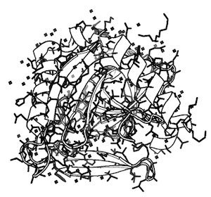
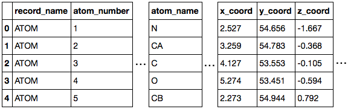
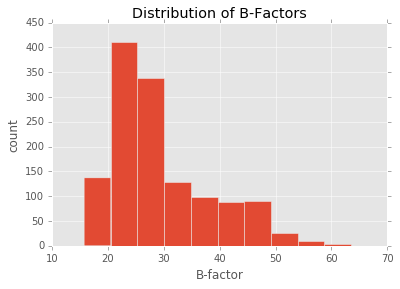
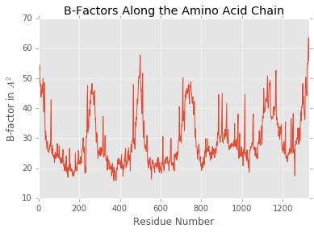

**Working with molecular structures in pandas DataFrames**


[](https://travis-ci.org/rasbt/biopandas)
[](https://pypi.python.org/pypi/biopandas/)
[](https://github.com/rasbt/biopandas/blob/master/LICENSE)

[](http://joss.theoj.org/papers/10.21105/joss.00279)
[

<br>

<hr>

#### Links

- Documentation: [http://rasbt.github.io/biopandas/](http://rasbt.github.io/biopandas/)
- Source code repository: [https://github.com/rasbt/biopandas](https://github.com/rasbt/biopandas)
- PyPI: [https://pypi.python.org/pypi/biopandas](https://pypi.python.org/pypi/biopandas)

<hr>

#### About  


If you are a computational biologist, chances are that you cursed one too many times about protein structure files. Yes, I am talking about ye Goode Olde Protein Data Bank format, aka "PDB files." Nothing against PDB, it's a neatly structured format (if deployed correctly); yet, it is a bit cumbersome to work with PDB files in "modern" programming languages -- I am pretty sure we all agree on this.

As machine learning and "data science" person, I fell in love with [pandas](http://pandas.pydata.org) DataFrames for handling just about everything that can be loaded into memory.  
So, why don't we take pandas to the structural biology world? Working with molecular structures of biological macromolecules (from PDB and MOL2 files) in pandas DataFrames is what BioPandas is all about!


<hr>

#### Examples



```python
# Initialize a new PandasPdb object
# and fetch the PDB file from rcsb.org
>>> from biopandas.pdb import PandasPdb
>>> ppdb = PandasPdb().fetch_pdb('3eiy')
>>> ppdb.df['ATOM'].head()
```



<br>


```python
# Load structures from your drive and compute the
# Root Mean Square Deviation
>>> from biopandas.pdb import PandasPdb
>>> pl1 = PandasPdb().read_pdb('./docking_pose_1.pdb')
>>> pl2 = PandasPdb().read_pdb('./docking_pose_2.pdb')
>>> r = PandasPdb.rmsd(pl1.df['HETATM'], pl2.df['HETATM'])
>>> print('RMSD: %.4f Angstrom' % r)
RMSD: 2.6444 Angstrom
```

<br>

```python
# Producing quick summary plots
>>> import matplotlib.pyplot as plt
>>> ppdb.df['ATOM']['b_factor'].plot(kind='hist')
>>> plt.title('Distribution of B-Factors')
>>> plt.xlabel('B-factor')
>>> plt.ylabel('count')
>>> plt.show()
```



<br>

```python
>>> ppdb.df['ATOM']['b_factor'].plot(kind='line')
>>> plt.title('B-Factors Along the Amino Acid Chain')
>>> plt.xlabel('Residue Number')
>>> plt.ylabel('B-factor in $A^2$')
>>> plt.show()
```




### Cite as

If you use BioPandas as part of your workflow in a scientific publication, please consider citing the BioPandas repository with the following DOI:

- Sebastian Raschka. Biopandas: Working with molecular structures in pandas dataframes. *The Journal of Open Source Software*, 2(14), jun 2017. doi: 10.21105/joss.00279. URL http://dx.doi.org/10.21105/joss.00279.

```
@article{raschkas2017biopandas,
  doi = {10.21105/joss.00279},
  url = {http://dx.doi.org/10.21105/joss.00279},
  year  = {2017},
  month = {jun},
  publisher = {The Open Journal},
  volume = {2},
  number = {14},
  author = {Sebastian Raschka},
  title = {BioPandas: Working with molecular structures in pandas DataFrames},
  journal = {The Journal of Open Source Software}
}
```

