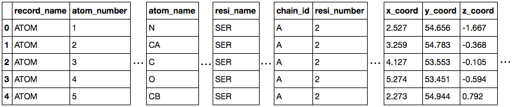

**Working with molecular structures in pandas DataFrames**


[](https://travis-ci.org/rasbt/biopandas)
[](https://pypi.python.org/pypi/biopandas/)
[](https://github.com/rasbt/biopandas/blob/master/LICENSE)


<hr>

## Links
- Documentation: [http://rasbt.github.io/biopandas/](http://rasbt.github.io/biopandas/)
- Source code repository: [https://github.com/rasbt/biopandas](https://github.com/rasbt/biopandas)
- PyPI: [https://pypi.python.org/pypi/biopandas](https://pypi.python.org/pypi/biopandas)

<br><br>

## Examples

<br>


```python
>>> ppdb = PandasPDB()
>>> ppdb.fetch_pdb('3eiy')
>>> ppdb.df['ATOM'].head()
```



<br><br>
<br><br>


```python
>>> pl1 = PandasPDB()
>>> pl1.read_pdb('./docking_pose_1.pdb')
>>> pl2 = PandasPDB()
>>> pl2.read_pdb('./docking_pose_2.pdb')

>>> r = PandasPDB.rmsd(pl1.df['HETATM'], pl2.df['HETATM'], s='no hydrogen')
>>> print('RMSD: %f' % r)
RMSD: 2.6444
```

<br><br>


## Quick Install

- latest version (from GitHub): `pip install git+git://github.com/rasbt/biopandas.git#egg=biopandas`
- latest PyPI version: `pip install biopandas`

<br><br>

<hr>

<div style="float: left;">
  <!-- Twitter Button -->

  <a href="https://twitter.com/share"
       class="twitter-share-button"
       data-url="http://rasbt.github.io/biopandas/"
       data-via="rasbt"
       data-count="right"
       data-text="BioPandas - Working with molecular structures in pandas DataFrames" data-lang="en">Tweet</a>
  <script>!function(d,s,id){var
          js,fjs=d.getElementsByTagName(s)[0];if(!d.getElementById(id)){js=d.createElement(s);js.id=id;js.src="https://platform.twitter.com/widgets.js";fjs.parentNode.insertBefore(js,fjs);}}
          (document,"script","twitter-wjs");</script>

<!-- LinkedIn -->
    <script src="//platform.linkedin.com/in.js" type="text/javascript"> lang: en_US</script>
    <script type="IN/Share" data-url="http://rasbt.github.io/biopandas/" data-counter="right"></script>

<!-- Google+ -->
  <script src="https://apis.google.com/js/platform.js" async defer></script>
  <div class="g-plusone" data-size="medium" data-href="http://rasbt.github.io/biopandas/"></div>

</div>
