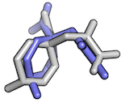
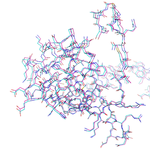

# Working with mmCIF Structures in DataFrames

## Loading mmCIF Files

There are 3 ways to load a mmCIF structure into a `PandasMmcif` object.


#### 1
MmCIF files can be directly fetched from The Protein Data Bank at [http://www.rcsb.org](http://www.rcsb.org) via its unique 4-letter after initializing a new [`PandasMmcif`](../api_subpackages/biopandas.mmcif) object and calling the `fetch_mmcif` method:


```python
from biopandas.mmcif import PandasMmcif

# Initialize a new PandasMmcif object
# and fetch the mmCIF file from rcsb.org
pmmcif = PandasMmcif().fetch_mmcif('3eiy')
```

#### 2 a)

Alternatively, we can load mmCIF files from local directories as regular mmCIF files using `read_mmcif`:


```python
pmmcif.read_mmcif('./data/3eiy.cif')
```


    <biopandas.mmcif.pandas_mmcif.PandasMmcif at 0x12753fdc0>


[File link: [3eiy.cif](https://raw.githubusercontent.com/rasbt/biopandas/main/docs/tutorials/data/3eiy.cif)]

#### 2 b)

Or, we can load them from gzip archives like so (note that the file must end with a '.gz' suffix in order to be recognized as a gzip file):


```python
pmmcif.read_mmcif('./data/3eiy.cif.gz')
```


    <biopandas.mmcif.pandas_mmcif.PandasMmcif at 0x12753fdc0>


[File link: [3eiy.cif.gz](https://github.com/rasbt/biopandas/blob/main/docs/tutorials/data/3eiy.cif.gz?raw=true)]

After the file was succesfully loaded, we have access to the following attributes:


```python
print('mmCIF Code: %s' % pmmcif.code)
print('mmCIF Header Line: %s' % pmmcif.header)
print('\nRaw mmCIF file contents:\n\n%s\n...' % pmmcif.pdb_text[:1000])
```

    mmCIF Code: 3eiy
    mmCIF Header Line: 
    
    Raw mmCIF file contents:
    
    data_3EIY
    # 
    _entry.id   3EIY 
    # 
    _audit_conform.dict_name       mmcif_pdbx.dic 
    _audit_conform.dict_version    5.281 
    _audit_conform.dict_location   http://mmcif.pdb.org/dictionaries/ascii/mmcif_pdbx.dic 
    # 
    loop_
    _database_2.database_id 
    _database_2.database_code 
    PDB   3EIY         
    RCSB  RCSB049380   
    WWPDB D_1000049380 
    # 
    loop_
    _pdbx_database_related.db_name 
    _pdbx_database_related.db_id 
    _pdbx_database_related.details 
    _pdbx_database_related.content_type 
    TargetDB BupsA.00023.a .                                                                        unspecified 
    PDB      3d63          
    ;The same protein, "open" conformation, apo form, in space group P21212
    ;
    unspecified 
    PDB      3EIZ          .                                                                        unspecified 
    PDB      3EJ0          .                                                                        unspecified 
    PDB      3EJ2          .                                                                       
    ...


The most interesting / useful attribute is the `PandasMmcif.df` DataFrame dictionary though, which gives us access to the mmCIF files as pandas DataFrames. Let's print the first 3 lines from the `ATOM` coordinate section to see how it looks like:


```python
pmmcif.df['ATOM'].head(3)
```


<div>
<style scoped>
    .dataframe tbody tr th:only-of-type {
        vertical-align: middle;
    }

    .dataframe tbody tr th {
        vertical-align: top;
    }

    .dataframe thead th {
        text-align: right;
    }
</style>
<table border="1" class="dataframe">
  <thead>
    <tr style="text-align: right;">
      <th></th>
      <th>group_PDB</th>
      <th>id</th>
      <th>type_symbol</th>
      <th>label_atom_id</th>
      <th>...</th>
      <th>auth_comp_id</th>
      <th>auth_asym_id</th>
      <th>auth_atom_id</th>
      <th>pdbx_PDB_model_num</th>
    </tr>
  </thead>
  <tbody>
    <tr>
      <th>0</th>
      <td>ATOM</td>
      <td>1</td>
      <td>N</td>
      <td>N</td>
      <td>...</td>
      <td>SER</td>
      <td>A</td>
      <td>N</td>
      <td>1</td>
    </tr>
    <tr>
      <th>1</th>
      <td>ATOM</td>
      <td>2</td>
      <td>C</td>
      <td>CA</td>
      <td>...</td>
      <td>SER</td>
      <td>A</td>
      <td>CA</td>
      <td>1</td>
    </tr>
    <tr>
      <th>2</th>
      <td>ATOM</td>
      <td>3</td>
      <td>C</td>
      <td>C</td>
      <td>...</td>
      <td>SER</td>
      <td>A</td>
      <td>C</td>
      <td>1</td>
    </tr>
  </tbody>
</table>
<p>3 rows × 21 columns</p>
</div>


But more on that in the next section.

#### 3

**Loading mmCif files from a Python List**

Mmcif files can also be loaded into a `PandasMmcif` object from a Python list:


```python
with open('./data/3eiy.cif', 'r') as f:
    three_eiy = f.read()

pmmcif2 = PandasMmcif()
pmmcif2.read_mmcif_from_list(three_eiy)

pmmcif2.df['ATOM'].head()
```


<div>
<style scoped>
    .dataframe tbody tr th:only-of-type {
        vertical-align: middle;
    }

    .dataframe tbody tr th {
        vertical-align: top;
    }

    .dataframe thead th {
        text-align: right;
    }
</style>
<table border="1" class="dataframe">
  <thead>
    <tr style="text-align: right;">
      <th></th>
      <th>group_PDB</th>
      <th>id</th>
      <th>type_symbol</th>
      <th>label_atom_id</th>
      <th>...</th>
      <th>auth_comp_id</th>
      <th>auth_asym_id</th>
      <th>auth_atom_id</th>
      <th>pdbx_PDB_model_num</th>
    </tr>
  </thead>
  <tbody>
    <tr>
      <th>0</th>
      <td>ATOM</td>
      <td>1</td>
      <td>N</td>
      <td>N</td>
      <td>...</td>
      <td>SER</td>
      <td>A</td>
      <td>N</td>
      <td>1</td>
    </tr>
    <tr>
      <th>1</th>
      <td>ATOM</td>
      <td>2</td>
      <td>C</td>
      <td>CA</td>
      <td>...</td>
      <td>SER</td>
      <td>A</td>
      <td>CA</td>
      <td>1</td>
    </tr>
    <tr>
      <th>2</th>
      <td>ATOM</td>
      <td>3</td>
      <td>C</td>
      <td>C</td>
      <td>...</td>
      <td>SER</td>
      <td>A</td>
      <td>C</td>
      <td>1</td>
    </tr>
    <tr>
      <th>3</th>
      <td>ATOM</td>
      <td>4</td>
      <td>O</td>
      <td>O</td>
      <td>...</td>
      <td>SER</td>
      <td>A</td>
      <td>O</td>
      <td>1</td>
    </tr>
    <tr>
      <th>4</th>
      <td>ATOM</td>
      <td>5</td>
      <td>C</td>
      <td>CB</td>
      <td>...</td>
      <td>SER</td>
      <td>A</td>
      <td>CB</td>
      <td>1</td>
    </tr>
  </tbody>
</table>
<p>5 rows × 21 columns</p>
</div>


## Looking at mmCIF files in DataFrames

mmCIF files are parsed according to the [mmCIF file format description](https://mmcif.wwpdb.org). More specifically, BioPandas  

TODO

For more information, we recommend the helpful [Beginner’s Guide to PDB Structures and the PDBx/mmCIF Format](https://pdb101.rcsb.org/learn/guide-to-understanding-pdb-data/beginner’s-guide-to-pdb-structures-and-the-pdbx-mmcif-format) guide.

After loading a PDB file from rcsb.org or our local drive, the [`PandasPdb.df`](../api/biopandas.pdb/#pandaspdbdf) attribute should contain the following 3 DataFrame objects:


```python
from biopandas.mmcif import PandasMmcif


pmmcif = PandasMmcif()
pmmcif.read_mmcif('./data/3eiy.cif')
pmmcif.df.keys()
```


    dict_keys(['ATOM', 'HETATM', 'ANISOU'])


[File link: [3eiy.cif](https://raw.githubusercontent.com/rasbt/biopandas/main/docs/tutorials/data/3eiy.cif)]

- 'ATOM': contains the entries from the ATOM coordinate section
- 'HETATM':  ... entries from the "HETATM" coordinate section    
- 'ANISOU': ... entries from the "ANISOU" coordinate section 

The columns of the 'HETATM' DataFrame are indentical to the 'ATOM' DataFrame that we've seen earlier:


```python
pmmcif.df['HETATM'].head(2)
```


<div>
<style scoped>
    .dataframe tbody tr th:only-of-type {
        vertical-align: middle;
    }

    .dataframe tbody tr th {
        vertical-align: top;
    }

    .dataframe thead th {
        text-align: right;
    }
</style>
<table border="1" class="dataframe">
  <thead>
    <tr style="text-align: right;">
      <th></th>
      <th>group_PDB</th>
      <th>id</th>
      <th>type_symbol</th>
      <th>label_atom_id</th>
      <th>...</th>
      <th>auth_comp_id</th>
      <th>auth_asym_id</th>
      <th>auth_atom_id</th>
      <th>pdbx_PDB_model_num</th>
    </tr>
  </thead>
  <tbody>
    <tr>
      <th>1330</th>
      <td>HETATM</td>
      <td>1331</td>
      <td>K</td>
      <td>K</td>
      <td>...</td>
      <td>K</td>
      <td>A</td>
      <td>K</td>
      <td>1</td>
    </tr>
    <tr>
      <th>1331</th>
      <td>HETATM</td>
      <td>1332</td>
      <td>NA</td>
      <td>NA</td>
      <td>...</td>
      <td>NA</td>
      <td>A</td>
      <td>NA</td>
      <td>1</td>
    </tr>
  </tbody>
</table>
<p>2 rows × 21 columns</p>
</div>


<br>

Note that "ANISOU" entries are handled a bit differently as specified at ???


```python
pmmcif.df['ANISOU'].head(2)
```


<div>
<style scoped>
    .dataframe tbody tr th:only-of-type {
        vertical-align: middle;
    }

    .dataframe tbody tr th {
        vertical-align: top;
    }

    .dataframe thead th {
        text-align: right;
    }
</style>
<table border="1" class="dataframe">
  <thead>
    <tr style="text-align: right;">
      <th></th>
      <th>id</th>
      <th>type_symbol</th>
      <th>pdbx_label_atom_id</th>
      <th>pdbx_label_alt_id</th>
      <th>...</th>
      <th>pdbx_auth_seq_id</th>
      <th>pdbx_auth_comp_id</th>
      <th>pdbx_auth_asym_id</th>
      <th>pdbx_auth_atom_id</th>
    </tr>
  </thead>
  <tbody>
  </tbody>
</table>
<p>0 rows × 18 columns</p>
</div>


Not every PDB file contains ANISOU entries (similarly, some PDB files may only contain HETATM or ATOM entries). If records are present, the DataFrame will be empty as show above.


```python
pmmcif.df['ANISOU'].empty
```


    True


Since the DataFrames are fairly wide, let's us take a look at the columns by accessing the DataFrame's `column` attribute:


```python
pmmcif.df['ANISOU'].columns
```


    Index(['id', 'type_symbol', 'pdbx_label_atom_id', 'pdbx_label_alt_id', 'pdbx_label_comp_id', 'pdbx_label_asym_id', 'pdbx_label_seq_id', 'pdbx_PDB_ins_code', 'U[1][1]', 'U[2][2]', 'U[3][3]', 'U[1][2]', 'U[1][3]', 'U[2][3]', 'pdbx_auth_seq_id', 'pdbx_auth_comp_id', 'pdbx_auth_asym_id', 'pdbx_auth_atom_id'], dtype='object')


TODO

<br>
<br>

Ah, another interesting thing to mention is that the columns already come with the types you'd expect (where `object` essentially "means" `str` here):


```python
pmmcif.df['ATOM'].dtypes
```


    group_PDB              object
    id                      int64
    type_symbol            object
    label_atom_id          object
    label_alt_id           object
    label_comp_id          object
    label_asym_id          object
    label_entity_id         int64
    label_seq_id           object
    pdbx_PDB_ins_code      object
    Cartn_x               float64
    Cartn_y               float64
    Cartn_z               float64
    occupancy             float64
    B_iso_or_equiv        float64
    pdbx_formal_charge     object
    auth_seq_id             int64
    auth_comp_id           object
    auth_asym_id           object
    auth_atom_id           object
    pdbx_PDB_model_num      int64
    dtype: object


<br>

## Working with mmCIF DataFrames

In the previous sections, we've seen how to load mmCIF structures into DataFrames, and how to access them. Now, let's talk about manipulating mmCIF files in DataFrames.


```python
from biopandas.mmcif import PandasMmcif
pmmcif = PandasMmcif()
pmmcif.read_mmcif('./data/3eiy.cif.gz')
pmmcif.df['ATOM'].head()
```


<div>
<style scoped>
    .dataframe tbody tr th:only-of-type {
        vertical-align: middle;
    }

    .dataframe tbody tr th {
        vertical-align: top;
    }

    .dataframe thead th {
        text-align: right;
    }
</style>
<table border="1" class="dataframe">
  <thead>
    <tr style="text-align: right;">
      <th></th>
      <th>group_PDB</th>
      <th>id</th>
      <th>type_symbol</th>
      <th>label_atom_id</th>
      <th>...</th>
      <th>auth_comp_id</th>
      <th>auth_asym_id</th>
      <th>auth_atom_id</th>
      <th>pdbx_PDB_model_num</th>
    </tr>
  </thead>
  <tbody>
    <tr>
      <th>0</th>
      <td>ATOM</td>
      <td>1</td>
      <td>N</td>
      <td>N</td>
      <td>...</td>
      <td>SER</td>
      <td>A</td>
      <td>N</td>
      <td>1</td>
    </tr>
    <tr>
      <th>1</th>
      <td>ATOM</td>
      <td>2</td>
      <td>C</td>
      <td>CA</td>
      <td>...</td>
      <td>SER</td>
      <td>A</td>
      <td>CA</td>
      <td>1</td>
    </tr>
    <tr>
      <th>2</th>
      <td>ATOM</td>
      <td>3</td>
      <td>C</td>
      <td>C</td>
      <td>...</td>
      <td>SER</td>
      <td>A</td>
      <td>C</td>
      <td>1</td>
    </tr>
    <tr>
      <th>3</th>
      <td>ATOM</td>
      <td>4</td>
      <td>O</td>
      <td>O</td>
      <td>...</td>
      <td>SER</td>
      <td>A</td>
      <td>O</td>
      <td>1</td>
    </tr>
    <tr>
      <th>4</th>
      <td>ATOM</td>
      <td>5</td>
      <td>C</td>
      <td>CB</td>
      <td>...</td>
      <td>SER</td>
      <td>A</td>
      <td>CB</td>
      <td>1</td>
    </tr>
  </tbody>
</table>
<p>5 rows × 21 columns</p>
</div>


[File link: [3eiy.cif.gz](https://github.com/rasbt/biopandas/blob/main/docs/tutorials/data/3eiy.cif.gz?raw=true)]

Okay, there's actually not *that* much to say ...   
Once we have our mmCIF file in the DataFrame format, we have the whole convenience of [pandas](http://pandas.pydata.org) right there at our fingertips.

For example, let's get all Proline residues:


```python
pmmcif.df['ATOM'][pmmcif.df['ATOM']['auth_comp_id'] == 'PRO'].head()
```


<div>
<style scoped>
    .dataframe tbody tr th:only-of-type {
        vertical-align: middle;
    }

    .dataframe tbody tr th {
        vertical-align: top;
    }

    .dataframe thead th {
        text-align: right;
    }
</style>
<table border="1" class="dataframe">
  <thead>
    <tr style="text-align: right;">
      <th></th>
      <th>group_PDB</th>
      <th>id</th>
      <th>type_symbol</th>
      <th>label_atom_id</th>
      <th>...</th>
      <th>auth_comp_id</th>
      <th>auth_asym_id</th>
      <th>auth_atom_id</th>
      <th>pdbx_PDB_model_num</th>
    </tr>
  </thead>
  <tbody>
    <tr>
      <th>38</th>
      <td>ATOM</td>
      <td>39</td>
      <td>N</td>
      <td>N</td>
      <td>...</td>
      <td>PRO</td>
      <td>A</td>
      <td>N</td>
      <td>1</td>
    </tr>
    <tr>
      <th>39</th>
      <td>ATOM</td>
      <td>40</td>
      <td>C</td>
      <td>CA</td>
      <td>...</td>
      <td>PRO</td>
      <td>A</td>
      <td>CA</td>
      <td>1</td>
    </tr>
    <tr>
      <th>40</th>
      <td>ATOM</td>
      <td>41</td>
      <td>C</td>
      <td>C</td>
      <td>...</td>
      <td>PRO</td>
      <td>A</td>
      <td>C</td>
      <td>1</td>
    </tr>
    <tr>
      <th>41</th>
      <td>ATOM</td>
      <td>42</td>
      <td>O</td>
      <td>O</td>
      <td>...</td>
      <td>PRO</td>
      <td>A</td>
      <td>O</td>
      <td>1</td>
    </tr>
    <tr>
      <th>42</th>
      <td>ATOM</td>
      <td>43</td>
      <td>C</td>
      <td>CB</td>
      <td>...</td>
      <td>PRO</td>
      <td>A</td>
      <td>CB</td>
      <td>1</td>
    </tr>
  </tbody>
</table>
<p>5 rows × 21 columns</p>
</div>


Or main chain atoms:


```python
pmmcif.df['ATOM'][pmmcif.df['ATOM']['label_atom_id'] == 'CA'].head()
```


<div>
<style scoped>
    .dataframe tbody tr th:only-of-type {
        vertical-align: middle;
    }

    .dataframe tbody tr th {
        vertical-align: top;
    }

    .dataframe thead th {
        text-align: right;
    }
</style>
<table border="1" class="dataframe">
  <thead>
    <tr style="text-align: right;">
      <th></th>
      <th>group_PDB</th>
      <th>id</th>
      <th>type_symbol</th>
      <th>label_atom_id</th>
      <th>...</th>
      <th>auth_comp_id</th>
      <th>auth_asym_id</th>
      <th>auth_atom_id</th>
      <th>pdbx_PDB_model_num</th>
    </tr>
  </thead>
  <tbody>
    <tr>
      <th>1</th>
      <td>ATOM</td>
      <td>2</td>
      <td>C</td>
      <td>CA</td>
      <td>...</td>
      <td>SER</td>
      <td>A</td>
      <td>CA</td>
      <td>1</td>
    </tr>
    <tr>
      <th>7</th>
      <td>ATOM</td>
      <td>8</td>
      <td>C</td>
      <td>CA</td>
      <td>...</td>
      <td>PHE</td>
      <td>A</td>
      <td>CA</td>
      <td>1</td>
    </tr>
    <tr>
      <th>18</th>
      <td>ATOM</td>
      <td>19</td>
      <td>C</td>
      <td>CA</td>
      <td>...</td>
      <td>SER</td>
      <td>A</td>
      <td>CA</td>
      <td>1</td>
    </tr>
    <tr>
      <th>24</th>
      <td>ATOM</td>
      <td>25</td>
      <td>C</td>
      <td>CA</td>
      <td>...</td>
      <td>ASN</td>
      <td>A</td>
      <td>CA</td>
      <td>1</td>
    </tr>
    <tr>
      <th>32</th>
      <td>ATOM</td>
      <td>33</td>
      <td>C</td>
      <td>CA</td>
      <td>...</td>
      <td>VAL</td>
      <td>A</td>
      <td>CA</td>
      <td>1</td>
    </tr>
  </tbody>
</table>
<p>5 rows × 21 columns</p>
</div>


It's also easy to strip our coordinate section from hydrogen atoms if there are any ...


```python
pmmcif.df['ATOM'][pmmcif.df['ATOM']['type_symbol'] != 'H'].head()
```


<div>
<style scoped>
    .dataframe tbody tr th:only-of-type {
        vertical-align: middle;
    }

    .dataframe tbody tr th {
        vertical-align: top;
    }

    .dataframe thead th {
        text-align: right;
    }
</style>
<table border="1" class="dataframe">
  <thead>
    <tr style="text-align: right;">
      <th></th>
      <th>group_PDB</th>
      <th>id</th>
      <th>type_symbol</th>
      <th>label_atom_id</th>
      <th>...</th>
      <th>auth_comp_id</th>
      <th>auth_asym_id</th>
      <th>auth_atom_id</th>
      <th>pdbx_PDB_model_num</th>
    </tr>
  </thead>
  <tbody>
    <tr>
      <th>0</th>
      <td>ATOM</td>
      <td>1</td>
      <td>N</td>
      <td>N</td>
      <td>...</td>
      <td>SER</td>
      <td>A</td>
      <td>N</td>
      <td>1</td>
    </tr>
    <tr>
      <th>1</th>
      <td>ATOM</td>
      <td>2</td>
      <td>C</td>
      <td>CA</td>
      <td>...</td>
      <td>SER</td>
      <td>A</td>
      <td>CA</td>
      <td>1</td>
    </tr>
    <tr>
      <th>2</th>
      <td>ATOM</td>
      <td>3</td>
      <td>C</td>
      <td>C</td>
      <td>...</td>
      <td>SER</td>
      <td>A</td>
      <td>C</td>
      <td>1</td>
    </tr>
    <tr>
      <th>3</th>
      <td>ATOM</td>
      <td>4</td>
      <td>O</td>
      <td>O</td>
      <td>...</td>
      <td>SER</td>
      <td>A</td>
      <td>O</td>
      <td>1</td>
    </tr>
    <tr>
      <th>4</th>
      <td>ATOM</td>
      <td>5</td>
      <td>C</td>
      <td>CB</td>
      <td>...</td>
      <td>SER</td>
      <td>A</td>
      <td>CB</td>
      <td>1</td>
    </tr>
  </tbody>
</table>
<p>5 rows × 21 columns</p>
</div>


Or, let's compute the average temperature factor of our protein main chain:


```python
mainchain = pmmcif.df['ATOM'][(pmmcif.df['ATOM']['label_atom_id'] == 'C') | 
                              (pmmcif.df['ATOM']['label_atom_id'] == 'O') | 
                              (pmmcif.df['ATOM']['label_atom_id'] == 'N') | 
                              (pmmcif.df['ATOM']['label_atom_id'] == 'CA')]

bfact_mc_avg = mainchain['occupancy'].mean()
print('Average B-Factor [Main Chain]: %.2f' % bfact_mc_avg)
```

    Average B-Factor [Main Chain]: 1.00


## Plotting

Since we are using pandas under the hood, which in turns uses matplotlib under the hood, we can produce quick summary plots of our mmCIF structures relatively conveniently:


```python
from biopandas.mmcif import PandasMmcif


pmmcif = PandasMmcif().read_mmcif('./data/3eiy.cif.gz')
```

[File link: [3eiy.cif.gz](https://github.com/rasbt/biopandas/blob/main/docs/tutorials/data/3eiy.cif.gz?raw=true)]


```python
%matplotlib inline
import matplotlib.pyplot as plt
from matplotlib import style
style.use('ggplot')
```


```python
pmmcif.df['ATOM']['occupancy'].plot(kind='hist')
plt.title('Distribution of B-Factors')
plt.xlabel('B-factor')
plt.ylabel('count')
plt.show()
```


    

    


```python
pmmcif.df['ATOM']['occupancy'].plot(kind='line')
plt.title('B-Factors Along the Amino Acid Chain')
plt.xlabel('Residue Number')
plt.ylabel('B-factor in $A^2$')
plt.show()
```


    

    


```python
pmmcif.df['ATOM']['type_symbol'].value_counts().plot(kind='bar')
plt.title('Distribution of Atom Types')
plt.xlabel('elements')
plt.ylabel('count')
plt.show()
```


    

    


## Computing the Root Mean Square Deviation

BioPandas also comes with certain convenience functions, for example, ...

The Root-mean-square deviation (RMSD) is simply a measure of the average distance between atoms of 2 protein or ligand structures. This calculation of the Cartesian error follows the equation:

$$
RMSD(a, b) = \sqrt{\frac{1}{n} \sum^{n}_{i=1} \big((a_{ix})^2 + (a_{iy})^2 + (a_{iz})^2 \big)}
= \sqrt{\frac{1}{n} \sum^{n}_{i=1} || a_i + b_i||_2^2}
$$

So, assuming that the we have the following 2 conformations of a ligand molecule



we can compute the RMSD as follows:


```python
from biopandas.mmcif import PandasMmcif

l_1 = PandasMmcif().read_mmcif('./data/lig_conf_1.cif')
l_2 = PandasMmcif().read_mmcif('./data/lig_conf_2.cif')
r = PandasMmcif.rmsd(l_1.df['HETATM'], l_2.df['HETATM'],
                   s=None) # all atoms, including hydrogens
print('RMSD: %.4f Angstrom' % r)
```

    RMSD: 2.6444 Angstrom


[File links: [lig_conf_1.pdb](https://raw.githubusercontent.com/rasbt/biopandas/main/docs/tutorials/data/lig_conf_1.cif), [lig_conf_2.cif](https://raw.githubusercontent.com/rasbt/biopandas/main/docs/tutorials/data/lig_conf_2.cif)]


```python
r = PandasMmcif.rmsd(l_1.df['HETATM'], l_2.df['HETATM'], 
                     s='carbon') # carbon atoms only
print('RMSD: %.4f Angstrom' % r)
```

    RMSD: 1.7249 Angstrom


```python
r = PandasMmcif.rmsd(l_1.df['HETATM'], l_2.df['HETATM'], 
                   s='heavy') # heavy atoms only
print('RMSD: %.4f Angstrom' % r)
```

    RMSD: 1.9959 Angstrom


Similarly, we can compute the RMSD between 2 related protein structures:



The hydrogen-free RMSD:


```python
p_1 = PandasMmcif().read_mmcif('./data/1t48_995.cif')
p_2 = PandasMmcif().read_mmcif('./data/1t49_995.cif')
r = PandasMmcif.rmsd(p_1.df['ATOM'], p_2.df['ATOM'], s='heavy')
print('RMSD: %.4f Angstrom' % r)
```

    RMSD: 0.7377 Angstrom


Or the RMSD between the main chains only:


```python
p_1 = PandasMmcif().read_mmcif('./data/1t48_995.cif')
p_2 = PandasMmcif().read_mmcif('./data/1t49_995.cif')
r = PandasMmcif.rmsd(p_1.df['ATOM'], p_2.df['ATOM'], s='main chain')
print('RMSD: %.4f Angstrom' % r)
```

    RMSD: 0.4781 Angstrom


<br>

## Filtering PDBs by Distance

We can use the `distance` method to compute the distance between each atom (or a subset of atoms) in our data frame and a three-dimensional reference point. For example:


```python
p_1 = PandasMmcif().read_mmcif('./data/3eiy.cif')

reference_point = (9.362, 41.410, 10.542)
distances = p_1.distance(xyz=reference_point, records=('ATOM',))
```

[File link: [3eiy.pdb](https://raw.githubusercontent.com/rasbt/biopandas/main/docs/tutorials/data/3eiy.cif)]

The distance method returns a Pandas Series object:


```python
distances.head()
```


    0    19.267419
    1    18.306060
    2    16.976934
    3    16.902897
    4    18.124171
    dtype: float64


And we can use this `Series` object, for instance, to select certain atoms in our DataFrame that fall within a desired distance threshold. For example, let's select all atoms that are within 7A of our reference point: 


```python
all_within_7A = p_1.df['ATOM'][distances < 7.0]
all_within_7A.tail()
```


<div>
<style scoped>
    .dataframe tbody tr th:only-of-type {
        vertical-align: middle;
    }

    .dataframe tbody tr th {
        vertical-align: top;
    }

    .dataframe thead th {
        text-align: right;
    }
</style>
<table border="1" class="dataframe">
  <thead>
    <tr style="text-align: right;">
      <th></th>
      <th>group_PDB</th>
      <th>id</th>
      <th>type_symbol</th>
      <th>label_atom_id</th>
      <th>...</th>
      <th>auth_comp_id</th>
      <th>auth_asym_id</th>
      <th>auth_atom_id</th>
      <th>pdbx_PDB_model_num</th>
    </tr>
  </thead>
  <tbody>
    <tr>
      <th>786</th>
      <td>ATOM</td>
      <td>787</td>
      <td>C</td>
      <td>CB</td>
      <td>...</td>
      <td>LEU</td>
      <td>A</td>
      <td>CB</td>
      <td>1</td>
    </tr>
    <tr>
      <th>787</th>
      <td>ATOM</td>
      <td>788</td>
      <td>C</td>
      <td>CG</td>
      <td>...</td>
      <td>LEU</td>
      <td>A</td>
      <td>CG</td>
      <td>1</td>
    </tr>
    <tr>
      <th>788</th>
      <td>ATOM</td>
      <td>789</td>
      <td>C</td>
      <td>CD1</td>
      <td>...</td>
      <td>LEU</td>
      <td>A</td>
      <td>CD1</td>
      <td>1</td>
    </tr>
    <tr>
      <th>789</th>
      <td>ATOM</td>
      <td>790</td>
      <td>C</td>
      <td>CD2</td>
      <td>...</td>
      <td>LEU</td>
      <td>A</td>
      <td>CD2</td>
      <td>1</td>
    </tr>
    <tr>
      <th>790</th>
      <td>ATOM</td>
      <td>791</td>
      <td>N</td>
      <td>N</td>
      <td>...</td>
      <td>VAL</td>
      <td>A</td>
      <td>N</td>
      <td>1</td>
    </tr>
  </tbody>
</table>
<p>5 rows × 21 columns</p>
</div>


Visualized in PyMOL, this subset (yellow surface) would look as follows:
    


## Converting Amino Acid codes from 3- to 1-letter codes

Residues in the `residue_name` field can be converted into 1-letter amino acid codes, which may be useful for further sequence analysis, for example, pair-wise or multiple sequence alignments:


```python
from biopandas.mmcif import PandasMmcif


pmmcif = PandasMmcif().fetch_mmcif('5mtn')
sequence = pmmcif.amino3to1()
sequence.tail()
```


<div>
<style scoped>
    .dataframe tbody tr th:only-of-type {
        vertical-align: middle;
    }

    .dataframe tbody tr th {
        vertical-align: top;
    }

    .dataframe thead th {
        text-align: right;
    }
</style>
<table border="1" class="dataframe">
  <thead>
    <tr style="text-align: right;">
      <th></th>
      <th>auth_asym_id</th>
      <th>auth_comp_id</th>
    </tr>
  </thead>
  <tbody>
    <tr>
      <th>1378</th>
      <td>B</td>
      <td>I</td>
    </tr>
    <tr>
      <th>1386</th>
      <td>B</td>
      <td>N</td>
    </tr>
    <tr>
      <th>1394</th>
      <td>B</td>
      <td>Y</td>
    </tr>
    <tr>
      <th>1406</th>
      <td>B</td>
      <td>R</td>
    </tr>
    <tr>
      <th>1417</th>
      <td>B</td>
      <td>T</td>
    </tr>
  </tbody>
</table>
</div>


As shown above, the `amino3to1` method returns a `DataFrame` containing the `auth_asym_id` (chain ID) and `auth_comp_id` (residue name) of the translated 1-letter amino acids. If you like to work with the sequence as a Python list of string characters, you could do the following:


```python
sequence_list = list(sequence.loc[sequence['auth_asym_id'] == 'A', 'auth_comp_id'])
sequence_list[-5:] # last 5 residues of chain A
```


    ['V', 'R', 'H', 'Y', 'T']


And if you prefer to work with the sequence as a string, you can use the `join` method: 


```python
''.join(sequence.loc[sequence['auth_asym_id'] == 'A', 'auth_comp_id'])
```


    'SLEPEPWFFKNLSRKDAERQLLAPGNTHGSFLIRESESTAGSFSLSVRDFDQGEVVKHYKIRNLDNGGFYISPRITFPGLHELVRHYT'


To iterate over the sequences of multi-chain proteins, you can use the `unique` method as shown below:


```python
for chain_id in sequence['auth_asym_id'].unique():
    print('\nChain ID: %s' % chain_id)
    print(''.join(sequence.loc[sequence['auth_asym_id'] == chain_id, 'auth_comp_id']))
```

    
    Chain ID: A
    SLEPEPWFFKNLSRKDAERQLLAPGNTHGSFLIRESESTAGSFSLSVRDFDQGEVVKHYKIRNLDNGGFYISPRITFPGLHELVRHYT
    
    Chain ID: B
    SVSSVPTKLEVVAATPTSLLISWDAPAVTVVYYLITYGETGSPWPGGQAFEVPGSKSTATISGLKPGVDYTITVYAHRSSYGYSENPISINYRT

